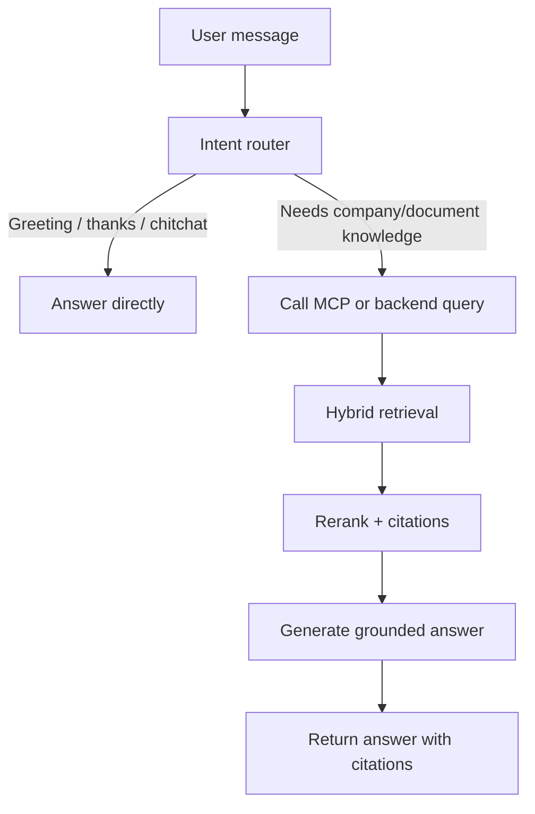

# Kế hoạch tối ưu chatbot dựa trên kỹ thuật của NexusRAG

Tài liệu này tổng hợp các kỹ thuật đang được dùng trong NexusRAG và cách áp dụng chúng để xây dựng hoặc tối ưu một chatbot có khả năng trả lời dựa trên tài liệu nội bộ, có citation, hạn chế hallucination, và biết phân biệt giữa câu chat hành vi thông thường với câu cần truy vấn knowledge base.

## 1. Mục tiêu tổng thể

Chatbot nên được thiết kế theo 2 lớp:

1. **Conversation layer**: xử lý lời chào, cảm ơn, small talk, câu hỏi về khả năng của bot, hoặc các hành vi giao tiếp không cần truy vấn tài liệu.
2. **Knowledge layer**: xử lý câu hỏi cần dữ liệu từ tài liệu, chính sách, báo cáo, hợp đồng, FAQ, dữ liệu khách hàng, hoặc knowledge base nội bộ.

Trong NexusRAG, phần knowledge layer được triển khai bằng pipeline RAG gồm:

- Document parsing bằng Docling hoặc Marker.
- Chunking theo cấu trúc tài liệu.
- Image/table captioning để tìm kiếm được nội dung phi văn bản.
- Vector search bằng ChromaDB.
- Knowledge graph bằng LightRAG.
- Cross-encoder reranking.
- Context assembly có citation.
- Agentic chat với tool calling.
- MCP server để chatbot/client bên ngoài gọi vào NexusRAG.

## 2. Kiến trúc đề xuất cho chatbot custom

Luồng xử lý khuyến nghị:



Nếu chatbot custom hỗ trợ MCP, nên dùng `mcp-server` như cổng kết nối. Nếu chatbot nằm trực tiếp trong backend/app riêng, có thể gọi API `/api/v1/rag/query/{workspace_id}` hoặc `/api/v1/rag/chat/{workspace_id}/stream`.

## 3. Kỹ thuật 1: Intent routing - phân biệt behavior chat và knowledge query

### Mục tiêu

Giúp chatbot biết khi nào trả lời trực tiếp và khi nào phải truy vấn tài liệu.

### Cách NexusRAG đang làm

Backend chat agent định nghĩa tool `search_documents` và yêu cầu model gọi tool này cho mọi câu hỏi/request/factual query. Chỉ bỏ qua tool với các tin nhắn đơn giản như:

- Lời chào: "hello", "xin chào", "hi".
- Cảm ơn/xác nhận: "cảm ơn", "thanks", "ok".
- Tạm biệt: "bye", "goodbye", "tạm biệt".
- Small talk không cần tài liệu.

### Plan triển khai

1. Tạo một router trước khi gọi LLM hoặc trước khi gọi RAG.
2. Định nghĩa nhóm intent:
   - `behavior`: lời chào, cảm ơn, tạm biệt, hỏi bot là ai, hỏi cách sử dụng.
   - `knowledge_query`: câu hỏi cần thông tin từ tài liệu hoặc dữ liệu công ty.
   - `ambiguous`: câu mơ hồ, có thể cần hỏi lại hoặc vẫn search nếu rủi ro cao.
3. Với `behavior`, trả lời trực tiếp bằng prompt ngắn, không gọi retrieval.
4. Với `knowledge_query`, bắt buộc gọi `query` hoặc `search_documents`.
5. Với `ambiguous`, ưu tiên search nếu câu có khả năng liên quan đến nghiệp vụ.

### Prompt mẫu

```text
Bạn là chatbot hỗ trợ dựa trên knowledge base.

Nếu người dùng chỉ chào hỏi, cảm ơn, tạm biệt, hoặc nói chuyện xã giao, hãy trả lời trực tiếp.
Nếu người dùng hỏi về chính sách, tài liệu, dữ liệu, báo cáo, sản phẩm, quy trình, khách hàng, hợp đồng, hoặc bất kỳ thông tin nào có thể nằm trong knowledge base, bắt buộc gọi công cụ tìm kiếm tài liệu trước khi trả lời.
Nếu không chắc có cần search không, hãy search.
Không được nói "không có thông tin trong tài liệu" nếu chưa search trong lượt hiện tại.
```

### Checklist

- Có danh sách intent rõ ràng.
- Có fallback khi câu mơ hồ.
- Có log lưu lại intent đã chọn.
- Có test case cho greeting, thanks, chitchat, câu hỏi nghiệp vụ, câu hỏi ngoài phạm vi.

## 4. Kỹ thuật 2: MCP server để kết nối chatbot bên ngoài với NexusRAG

### Mục tiêu

Cho phép chatbot/client bên ngoài như Cursor, Claude Desktop, hoặc chatbot custom gọi vào knowledge base của NexusRAG.

### Cách NexusRAG đang làm

Folder `mcp-server` tạo MCP server với các tool:

- `get_workspace_list`: lấy danh sách workspace.
- `get_document_by_id`: lấy markdown của document.
- `query`: truy vấn tài liệu bằng semantic/hybrid search.
- `get_chunks`: lấy raw chunks của document.

MCP server không tự làm RAG. Nó proxy request sang backend NexusRAG qua `API_BASE_URL`.

### Plan triển khai

1. Chạy full stack NexusRAG bằng Docker Compose.
2. Đảm bảo backend chạy ở port `8080`.
3. Đảm bảo MCP server chạy ở `http://localhost:8000/mcp`.
4. Trong chatbot/client, cấu hình MCP endpoint:

```text
http://localhost:8000/mcp
```

5. Khi chatbot cần knowledge:
   - Gọi `get_workspace_list` nếu chưa biết workspace.
   - Chọn đúng `workspace_id`.
   - Gọi `query` với `workspace_id`, `question`, `top_k`, `mode`.
6. Dùng kết quả chunks/citations để sinh câu trả lời cuối.

### Checklist

- MCP server kết nối được.
- Tool descriptions đủ rõ để model biết khi nào gọi.
- Chatbot biết lấy `workspace_id` trước khi query.
- Có xử lý lỗi khi backend chưa chạy hoặc workspace chưa có document.

## 5. Kỹ thuật 3: Document parsing giữ cấu trúc tài liệu

### Mục tiêu

Tăng chất lượng retrieval bằng cách giữ heading, page number, bảng, ảnh, layout, và ngữ cảnh tài liệu.

### Cách NexusRAG đang làm

NexusRAG hỗ trợ:

- **Docling**: mặc định, mạnh về parsing có cấu trúc.
- **Marker**: nhẹ GPU hơn, tốt hơn với công thức/toán học trong một số trường hợp.

Hai parser cùng trả về contract chung để downstream pipeline không đổi.

### Plan triển khai

1. Xác định loại tài liệu chính:
   - PDF scan, báo cáo, hợp đồng, tài liệu kỹ thuật.
   - Có nhiều bảng/công thức hay không.
   - Có ảnh/chart quan trọng hay không.
2. Chọn parser:
   - Dùng Docling nếu cần pipeline mặc định, cấu trúc ổn định.
   - Dùng Marker nếu cần nhẹ GPU hoặc tài liệu nhiều công thức.
3. Lưu metadata cho mỗi chunk:
   - `document_id`
   - `source_file`
   - `page_no`
   - `heading_path`
   - custom metadata như `year`, `department`, `category`.
4. Kiểm tra parsed markdown trước khi indexing.
5. Nếu tài liệu parse lỗi, đưa vào hàng xử lý lại hoặc fallback parser.

### Checklist

- Page number không bị mất.
- Heading path được giữ.
- Bảng không bị vỡ quá nặng.
- Ảnh/chart quan trọng được extract.
- Có trạng thái document: pending, parsing, indexing, indexed, failed.

## 6. Kỹ thuật 4: Chunking theo cấu trúc và ngữ nghĩa

### Mục tiêu

Tạo chunk vừa đủ nhỏ để retrieval chính xác, nhưng vẫn đủ ngữ cảnh để LLM trả lời đúng.

### Cách NexusRAG đang làm

Docling dùng HybridChunker, kết hợp semantic và structural chunking. Marker dùng heading-aware và page-based chunking.

### Plan triển khai

1. Không chia chunk đơn thuần theo số ký tự nếu tài liệu có cấu trúc rõ.
2. Ưu tiên chunk theo:
   - Heading/subheading.
   - Page boundary.
   - Paragraph group.
   - Table block.
3. Gắn metadata vào từng chunk.
4. Enrich chunk bằng caption ảnh/bảng cùng trang.
5. Deduplicate chunk để tránh nội dung lặp làm nhiễu retrieval.
6. Test câu hỏi theo từng loại:
   - Fact ngắn.
   - Câu hỏi cần bảng.
   - Câu hỏi cần tổng hợp nhiều phần.

### Checklist

- Chunk không cắt giữa câu quan trọng.
- Chunk có heading/page.
- Bảng/ảnh cùng trang có thể được tìm qua text caption.
- Có thống kê số chunk/document.

## 7. Kỹ thuật 5: Image và table captioning

### Mục tiêu

Giúp chatbot tìm và trả lời được thông tin nằm trong ảnh, biểu đồ, sơ đồ, hoặc bảng.

### Cách NexusRAG đang làm

Ảnh và bảng được extract, sau đó LLM tạo caption/tóm tắt. Caption này được append vào chunk cùng trang trước khi embed.

Ví dụ:

```text
[Image on page 5]: Graph showing revenue growth by quarter.
[Table on page 7 (5x4)]: Annual sales by region and product line.
```

### Plan triển khai

1. Bật image extraction nếu tài liệu có chart/diagram.
2. Bật image captioning nếu dùng model vision.
3. Với table, tạo summary ngắn:
   - Bảng nói về gì.
   - Các cột chính.
   - Giá trị nổi bật.
4. Append caption vào chunk trước khi embed.
5. Khi retrieval trúng chunk, trả kèm image/table reference nếu có.
6. Trong câu trả lời, yêu cầu LLM cite ảnh dạng `[IMG-xxxx]` khi dùng thông tin từ ảnh.

### Checklist

- Caption không quá dài.
- Caption chứa số liệu/nhãn/trend quan trọng.
- Không caption chung chung như "an image of a chart".
- Có URL để frontend hiển thị ảnh liên quan.

## 8. Kỹ thuật 6: Vector search với over-fetch

### Mục tiêu

Tìm nhiều candidate liên quan ban đầu để tránh bỏ sót thông tin.

### Cách NexusRAG đang làm

NexusRAG dùng ChromaDB và embedding model `BAAI/bge-m3`. Pipeline over-fetch khoảng top 20 candidate trước khi rerank.

### Plan triển khai

1. Embed tất cả chunks bằng một model multilingual tốt.
2. Lưu vector theo workspace riêng.
3. Khi query:
   - Không lấy top 5 trực tiếp làm final.
   - Over-fetch top 20 hoặc top 30.
4. Áp metadata filter trước nếu có:
   - document id
   - category
   - year
   - department
5. Chuyển candidate sang reranker.

### Checklist

- Embedding dimension khớp với vector DB.
- Mỗi workspace có collection riêng.
- Có metadata filter để giảm nhiễu.
- Có fallback nếu vector DB trả rỗng.

## 9. Kỹ thuật 7: Cross-encoder reranking

### Mục tiêu

Tăng độ chính xác bằng cách chấm lại từng cặp `(query, chunk)` thay vì chỉ dựa vào cosine similarity.

### Cách NexusRAG đang làm

Dùng `BAAI/bge-reranker-v2-m3` để rerank candidate từ vector search. Sau đó giữ top K cuối cùng, ví dụ top 8.

### Plan triển khai

1. Vector search lấy top 20 candidate.
2. Reranker nhận:
   - query gốc hoặc query đã rewrite.
   - danh sách chunk content.
3. Chấm điểm từng candidate.
4. Giữ top K theo score.
5. Đặt relevance threshold.
6. Nếu tất cả dưới threshold, fallback top 3 để LLM vẫn có cơ sở kiểm tra.

### Checklist

- Có log score trước/sau rerank.
- Có threshold chống nhiễu.
- Có fallback khi reranker lọc hết.
- Test với câu hỏi dễ nhầm giữa nhiều tài liệu.

## 10. Kỹ thuật 8: Knowledge graph bằng LightRAG

### Mục tiêu

Bổ sung khả năng hiểu entity, relationship và truy vấn nhiều bước, đặc biệt khi câu hỏi cần tổng hợp giữa nhiều phần tài liệu.

### Cách NexusRAG đang làm

LightRAG extract entities/relationships theo workspace và hỗ trợ các mode như local, global, hybrid.

### Plan triển khai

1. Khi ingest document, đưa markdown vào KG pipeline.
2. Extract entity:
   - Person
   - Organization
   - Product
   - Location
   - Event
   - Date
   - Metric
   - Regulation
3. Extract relationship giữa entities.
4. Lưu KG theo workspace.
5. Khi query:
   - Dùng vector search để tìm passage cụ thể.
   - Dùng KG để lấy entity context hoặc multi-hop relation.
   - Kết hợp cả hai trong hybrid mode.
6. Không để KG-generated answer thay thế nguồn gốc từ chunk nếu cần citation chính xác.

### Checklist

- Entity extraction không rỗng trên tài liệu thật.
- Có graph analytics để kiểm tra entity count/relationship count.
- Có mode hybrid mặc định.
- Với câu hỏi factual, vẫn ưu tiên chunk có citation.

## 11. Kỹ thuật 9: Citation và grounded answer

### Mục tiêu

Mọi câu trả lời dựa trên tài liệu phải có nguồn rõ ràng, giúp người dùng kiểm chứng.

### Cách NexusRAG đang làm

Mỗi source được gán citation ID 4 ký tự như `[a3x9]`. Citation gắn với:

- source file
- document id
- page number
- heading path
- chunk content

### Plan triển khai

1. Mỗi lượt trả lời tạo citation ID mới.
2. Không reuse citation ID từ lượt trước.
3. Khi build prompt, đưa source theo format rõ:

```text
Source [a3x9] (file.pdf, page 5, Heading > Subheading):
...
```

4. Trong system prompt, yêu cầu:
   - Claim nào dùng tài liệu thì phải cite.
   - Không gom toàn bộ citation ở cuối.
   - Không cite source không hỗ trợ trực tiếp claim.
5. Nếu không có source phù hợp, trả lời rằng tài liệu không chứa thông tin đó.

### Checklist

- Citation hiển thị được trên frontend.
- Click citation nhảy đến document/page/heading.
- Câu trả lời không có claim unsupported.
- Có test chống hallucination.

## 12. Kỹ thuật 10: Force-search mode

### Mục tiêu

Đảm bảo chatbot luôn search trước khi trả lời các câu hỏi cần tài liệu, kể cả khi model tool-calling không ổn định.

### Cách NexusRAG đang làm

`force_search=True` sẽ pre-search trước khi gọi LLM, rồi inject sources vào prompt. Khi `force_search=False`, model tự quyết định gọi tool trong agentic loop.

### Plan triển khai

1. Với môi trường production/customer support, bật force-search cho các câu `knowledge_query`.
2. Chỉ tắt force-search nếu model tool calling đã được kiểm chứng tốt.
3. Router quyết định:
   - `behavior`: không force-search.
   - `knowledge_query`: force-search.
4. Nếu retrieval rỗng, yêu cầu LLM nói rõ không tìm thấy trong tài liệu.
5. Log lại query đã rewrite và sources trả về.

### Checklist

- Không có câu factual trả lời từ kiến thức model mà chưa search.
- Có event/status "retrieving" trong UI.
- Có fallback khi không có source.

## 13. Kỹ thuật 11: Query rewriting

### Mục tiêu

Biến câu hỏi ngắn/mơ hồ của user thành query rõ hơn để retrieval tốt hơn.

### Cách NexusRAG đang làm

Tool description yêu cầu model rewrite query chi tiết trước khi gọi `search_documents`.

Ví dụ:

```text
"doanh thu?" -> "doanh thu thuần, tổng doanh thu theo năm, tăng trưởng doanh thu"
```

### Plan triển khai

1. Trước retrieval, rewrite query bằng LLM hoặc rule nhẹ.
2. Giữ lại cả original question và rewritten query.
3. Dùng rewritten query cho vector/KG retrieval.
4. Dùng original question khi generate answer để giữ đúng ý user.
5. Với multi-turn, thêm ngữ cảnh hội thoại gần nhất vào rewrite.

### Checklist

- Query rewrite không đổi ý câu hỏi.
- Không thêm assumption không có trong user message.
- Có log để debug retrieval.

## 14. Kỹ thuật 12: Metadata filtering và workspace isolation

### Mục tiêu

Giảm nhiễu retrieval và tránh chatbot lấy nhầm dữ liệu giữa khách hàng/phòng ban/workspace.

### Cách NexusRAG đang làm

Mỗi workspace là một knowledge base riêng, có collection và KG riêng. Query hỗ trợ `metadata_filter`.

### Plan triển khai

1. Thiết kế workspace theo tenant/domain:
   - mỗi khách hàng một workspace
   - mỗi phòng ban một workspace
   - mỗi sản phẩm một workspace
2. Khi upload document, gắn custom metadata:
   - `category`
   - `year`
   - `author`
   - `department`
   - `customer_id`
3. Khi query, áp filter theo user/session.
4. Không cho user query workspace không được phép.
5. Log workspace/filter trong mỗi request.

### Checklist

- Không leak dữ liệu giữa workspace.
- Filter dùng được trong query/chat API.
- UI cho phép chọn document scope nếu cần.

## 15. Kỹ thuật 13: Streaming chat và agent steps

### Mục tiêu

Tăng trải nghiệm người dùng khi câu trả lời mất thời gian do retrieval, rerank, hoặc LLM generation.

### Cách NexusRAG đang làm

Backend dùng SSE streaming với event:

- `status`
- `thinking`
- `sources`
- `images`
- `token`
- `complete`
- `error`

### Plan triển khai

1. Dùng endpoint streaming cho chatbot UI.
2. Hiển thị trạng thái:
   - analyzing
   - retrieving
   - generating
   - done
3. Stream token từng phần.
4. Hiển thị source cards ngay khi có sources.
5. Gửi heartbeat để tránh timeout.
6. Khi error, trả message rõ ràng và cho phép retry.

### Checklist

- UI không đứng im khi backend đang search.
- Có heartbeat cho response dài.
- Có retry khi LLM hoặc retrieval lỗi.

## 16. Kỹ thuật 14: Multi-provider LLM

### Mục tiêu

Cho phép chuyển giữa cloud model và local model tùy yêu cầu chi phí, bảo mật, tốc độ.

### Cách NexusRAG đang làm

Hỗ trợ Gemini và Ollama. KG embedding cũng tách riêng provider: Gemini, Ollama, hoặc sentence-transformers.

### Plan triển khai

1. Tách config:
   - chat LLM
   - vision LLM
   - embedding model
   - KG embedding model
   - reranker model
2. Với production cần chất lượng cao:
   - dùng Gemini cho chat/vision.
   - dùng local embedding/reranker để tiết kiệm.
3. Với môi trường private/offline:
   - dùng Ollama cho chat.
   - dùng sentence-transformers cho embedding.
4. Tạo capability probe:
   - model có native tool calling không.
   - model có vision không.
   - model có thinking không.
5. Có fallback khi model trả output rỗng hoặc không gọi tool.

### Checklist

- Config đổi provider không cần sửa code.
- Có fallback prompt-based tool calling.
- Có kiểm thử riêng cho từng provider.

## 17. Kỹ thuật 15: Evaluation và feedback loop

### Mục tiêu

Đo chất lượng chatbot thay vì chỉ cảm nhận thủ công.

### Cách NexusRAG đang làm

README mô tả đánh giá bằng hand-crafted tests và RAGAS synthetic tests, đo các metric như faithfulness, factual correctness, context recall, citation accuracy.

### Plan triển khai

1. Tạo bộ câu hỏi test theo tài liệu thật.
2. Nhóm test:
   - fact extraction
   - table data
   - cross-document reasoning
   - anti-hallucination
   - multi-turn
   - citation accuracy
3. Với mỗi câu, lưu expected answer/source.
4. Chạy test sau mỗi thay đổi parser/chunking/model.
5. Thu feedback người dùng:
   - relevant
   - partial
   - not relevant
6. Dùng feedback để điều chỉnh:
   - chunk size
   - top_k
   - reranker threshold
   - metadata filter
   - prompt citation rules

### Checklist

- Có test chống trả lời bịa.
- Có test câu hỏi ngoài phạm vi.
- Có dashboard pass rate/score.
- Có lưu rating citation.

## 18. Lộ trình triển khai đề xuất

### Phase 1: Baseline chatbot với RAG

1. Chạy NexusRAG backend, frontend, ChromaDB, PostgreSQL.
2. Upload tài liệu mẫu.
3. Parse và index tài liệu.
4. Test `/rag/query/{workspace_id}`.
5. Test chat streaming.
6. Kiểm tra citation và source cards.

Kết quả mong muốn: chatbot trả lời được câu hỏi dựa trên tài liệu, có citation.

### Phase 2: Router behavior/query

1. Viết intent prompt/router.
2. Test với lời chào/cảm ơn/tạm biệt.
3. Test với câu hỏi nghiệp vụ.
4. Bật force-search cho `knowledge_query`.
5. Log intent, query, source count.

Kết quả mong muốn: câu xã giao không search, câu nghiệp vụ bắt buộc search.

### Phase 3: MCP integration

1. Chạy MCP server tại `http://localhost:8000/mcp`.
2. Kết nối chatbot/client bên ngoài.
3. Test tool `get_workspace_list`.
4. Test tool `query`.
5. Tối ưu tool description nếu model gọi sai tool.

Kết quả mong muốn: chatbot ngoài hệ thống có thể truy vấn NexusRAG.

### Phase 4: Retrieval quality

1. Kiểm tra chunking.
2. Bật over-fetch.
3. Bật reranker.
4. Tối ưu top_k và threshold.
5. Thêm metadata filter.
6. Test câu hỏi khó và câu hỏi nhiều tài liệu.

Kết quả mong muốn: source trả về chính xác hơn, ít nhiễu hơn.

### Phase 5: Multimodal và structured content

1. Bật image extraction.
2. Bật table captioning.
3. Kiểm tra caption ảnh/chart.
4. Đảm bảo ảnh/bảng được đưa vào context.
5. Test câu hỏi về biểu đồ, bảng, số liệu.

Kết quả mong muốn: chatbot trả lời được thông tin nằm trong bảng/ảnh.

### Phase 6: Evaluation production

1. Tạo test set.
2. Chạy evaluation định kỳ.
3. Theo dõi hallucination/citation accuracy.
4. Thu user feedback.
5. Điều chỉnh retrieval/prompt/model.

Kết quả mong muốn: có số liệu để cải thiện chatbot liên tục.

## 19. Khuyến nghị cấu hình ban đầu

Cho chatbot customer-facing, nên bắt đầu với cấu hình an toàn:

```text
mode = hybrid
top_k = 8
vector_prefetch = 20
reranker = enabled
force_search = true với knowledge_query
metadata_filter = enabled nếu có tenant/category
citations = required
```

Router nên ưu tiên search khi không chắc. Chi phí search thêm thường nhỏ hơn rủi ro chatbot trả lời sai cho khách hàng.

## 20. Các rủi ro cần kiểm soát

| Rủi ro | Cách giảm thiểu |
|---|---|
| Bot trả lời từ kiến thức model thay vì tài liệu | Bật force-search, prompt bắt buộc citation |
| Retrieval lấy sai tài liệu | Dùng workspace isolation, metadata filter, reranker |
| Citation không hỗ trợ claim | Prompt citation chặt, evaluation citation accuracy |
| Bảng/ảnh bị bỏ sót | Bật captioning và append caption vào chunk |
| Model không gọi tool | Dùng force-search hoặc fallback prompt-based tool calling |
| Dữ liệu giữa khách hàng bị lẫn | Tách workspace và kiểm soát permission |
| Query mơ hồ | Query rewriting và hỏi lại nếu cần |

## 21. Tóm tắt quyết định thiết kế

Nên xem `mcp-server` là cổng đưa NexusRAG vào chatbot bên ngoài, không phải bộ não phân loại intent. Bộ não phân loại nên nằm ở chatbot system prompt/router hoặc backend chat agent.

Thiết kế tối ưu là:

1. Router phân loại behavior vs knowledge query.
2. Knowledge query bắt buộc search qua MCP/backend.
3. Retrieval dùng hybrid vector + KG.
4. Candidate được rerank bằng cross-encoder.
5. Câu trả lời được generate từ context có citation.
6. Evaluation đo hallucination, faithfulness, context recall và citation accuracy.

